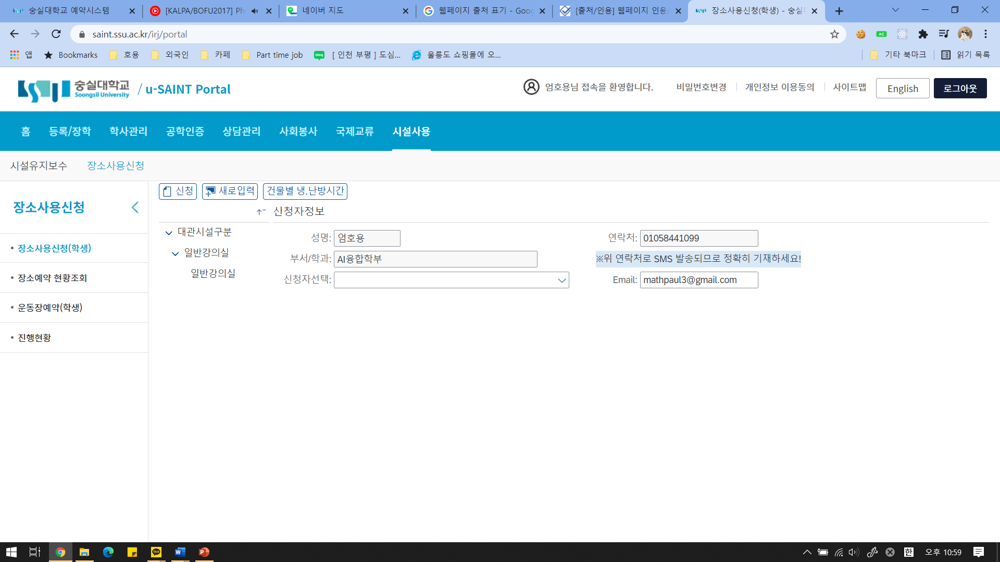

# 숭실대학교 장소사용 신청 페이지

## 패키지 다운로드(Project Setup)
```
yarn install
```

### 컴파일 및 개발용 hot-reload(Compiles and hot-reloads for development)
```
yarn serve
```

### 환경 설정 커스터마이징
See [Configuration Reference](https://cli.vuejs.org/config/).

## 개요
기존의 u-SAINT 장소사용 신청 페이지가 직관적이지 못하여 제 역할을 못하고 있다고 느껴,  
**직접** 페이지를 제작해보고자 본 프로젝트를 시작하였음  
(오픈소스 기초설계 과목의 과제로 사용)



## 본 Markdown 파일에서 사용한 Markdown 문법

- **제목** \#  
- **코드 삽입** \`code\`  
- **강조** \*\*  
- **링크 삽입** \[설명\]\(링크\)  
- **이미지 삽입** \!\[설명\]\(링크\)  
- **개행** (줄 마지막에 space 두 번)  
- **Escape sequences** \\\#  
- **열거** \-
